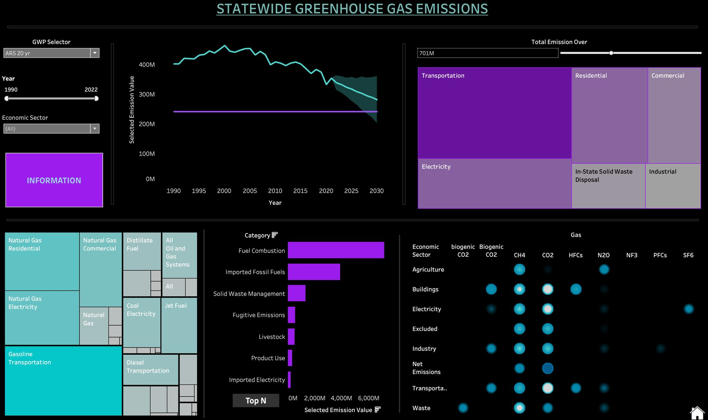
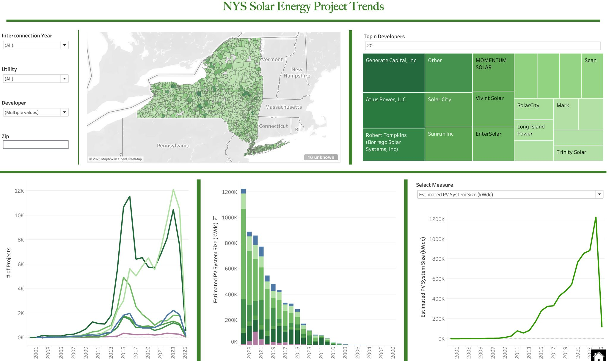
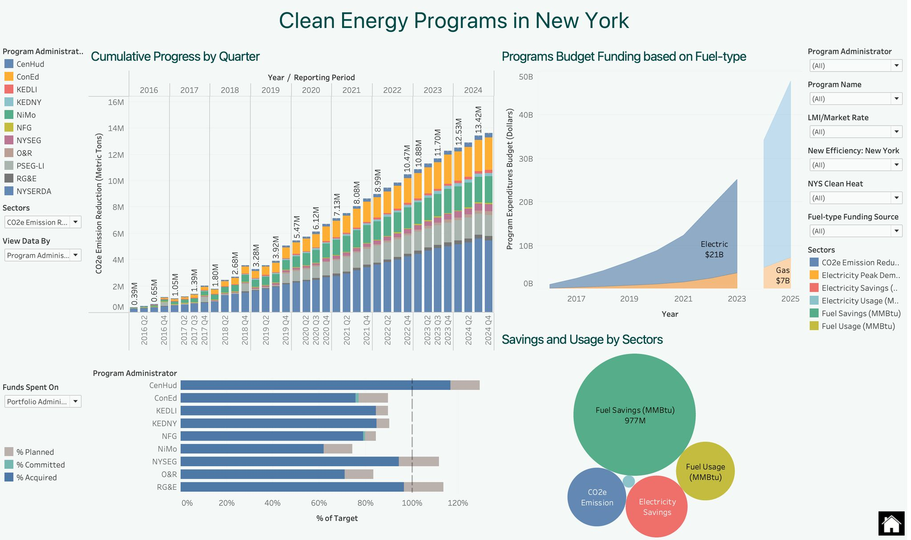

# 🌿 NYS Energy GHG Analytics

Interactive Tableau dashboard suite analyzing **New York State greenhouse gas emissions, distributed solar energy adoption, and Clean Energy Fund performance**, built using publicly available **NYS Open Data**.

**Tools:** Tableau Desktop, NYS Open Data, Excel, SQL, GitHub  
**Domain:** Energy & Environmental Analytics  
---

## 🌿 Project Overview

Built an **interactive Tableau dashboard suite** focused on **sustainability and clean energy initiatives across New York State**, leveraging **NYS Open Data** to transform fragmented public datasets into decision-ready analytics.

The dashboard suite includes:

- ✅ **Clean Energy Programs in New York** — Visualizes cumulative program progress, budget allocation, emissions reduction, and energy savings across statewide clean energy initiatives.
- ✅ **NYS Solar Energy Project Trends** — Analyzes solar installation growth trends, top developers, utility performance, and regional project distribution across New York State.
- ✅ **Statewide Greenhouse Gas Emissions** — Tracks long-term greenhouse gas emissions by sector, fuel type, and gas composition with interactive drill-down selections.

Designed to be **interactive, user-friendly, and visually compelling**, these dashboards help **policy teams, sustainability analysts, and program stakeholders** make **data-driven decisions that support New York’s clean energy transition goals**. 🌎✨

---

# 📊 Dashboard Screenshots

## 🌍 Statewide Greenhouse Gas Emissions

## ☀️ NYS Solar Energy Project Trends

## ⚡ Clean Energy Programs in New York

---

# Data Sources
Data files are excluded due to large size.

Sources:
- NYS Open Data — GHG Emissions
- NYS Open Data — Distributed Solar Projects
- NYSERDA Open Data — CED Program
- NYSERDA Open Data — Participants

---

# Key Business Questions Answered
- How have NYS GHG emissions changed since 1990?
- Which sectors are driving reductions?
- Which utilities lead solar adoption?
- Who are the top developers by capacity?
- Which ZIP codes lag in clean energy adoption?
- How is CED program spending performing?

---

# About This Project
This project demonstrates:
- stakeholder analysis
- business requirement gathering
- KPI design
- Tableau dashboard development
- data validation
- BA documentation
- business storytelling
